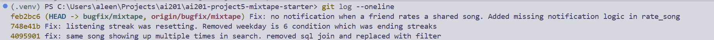

# Mixtape Bug Hunt — Submission

## AI Usage

> Describe specifically how you used AI tools during this project. Be honest about
> the collaboration — this section is not meant to prove you did everything alone.

- **Codebase navigation:** What did you ask AI to explain, summarize, or trace during Milestone 1?
I asked AI to summarize each service file and trace the flow of one endpoint.
- **Debugging:** What did you ask AI to help you understand about suspicious functions or code paths? I asked it to explain functions to me simply if I was a bit confused. 
- **Where AI helped:** AI was useful to develop a first impression of the codebase. It was helpful in explaining code. 
- **Where AI was wrong, incomplete, or pointed you the wrong way, and how you caught it:** AI's initial explanation of search_service.py did not talk about the join much and I actually noticed that is was weird myself. So, it did not point me in the direction of it; I had to read the code to find it. 

---

## Codebase Map

> Write this *before* touching any issue. Name the responsibility of each major
> file/module — don't just list file names.

### Main files and their roles

- `seed_data.py` — populates the database
- `app.py` / `app:create_app` — Flask app factory, sets up SQLAlchemy, registers blueprints (feature/pattern of Flask which organizes routes into components before attached to app)
- `models.py` — contains data models including User, Song, ListeningEvent, Rating, Playlist, Notification
- `routes/` — controller layer -- songs.py: searches and gets songs from database. playlists.py: create, get playlist and list/add songs, users.py: get user, streak, notifications, feed.py: friends listening now, activity feed
- `services/` — streak_service.py increments the streak on consecutive days otherwise it resets. feed_service.py gets friends listening info and get activity feed is a general activity log method. search_service.py is for searching songs by title/artist that the user likes. notification_service.py handles creating and getting notifications. playlist_service.py creates and gets playlists.

### Data flow: How is song added to user's feed?

> Trace it step by step: which route is hit, which service functions are called,
> in what order, what gets written to the database, etc.

1. POST /songs/<song_id>/listen is hit and calls record_listening_event(user_id, song_id)
2. Hit services/streak_service.py: load the user and create ListeningEvent(user_id, song_id, listened_at=now) and then calls update_listening_streak.
3. update_listening_streak compares now and user's last_listened_at in streak_service.py, then it updates the streak. resets if there is a gap and no change if listened today already
4. Feed is read with routes/feed.py, GET /feed/ endpoints (multiple) are used to read. The endpoints query ListeningEvent rows for the user's friends. The endpoints run when the listening now or activity tab are opened. 

### Patterns noticed

- Routes do not interact with the database directly or raise errors, they convert the errors to status codes. 

---

## Root Cause Analysis Entries

> One complete entry per bug fixed (minimum 3, stretch: 4th and 5th). All five
> fields are required for each entry. Fill these in as you go — not at the end.

### Bug #3: the same song keeps showing up twice in search 

**How you reproduced it**
- Steps / inputs / sequence of actions / data condition that triggered the behavior:
- I searched for songs with multiple tags like "Harlem Renaissance" which has three tags: rap, hip-hop, and soul. So when we hit that endpoint, we have Harlem Renaissance appear 3 times. 

**How you found the root cause**
- Files examined, in order: we go to search_service.py and look at the search function. We focus on what the search function is doing and try to see if there is anything unusual. Then I see a join (outer join) happening in search_songs on song_tags which is just kind of weird. 
- The moment you were confident you'd found the *actual* cause (not just a suspicious area): I inspected the seed data and saw that some songs have multiple tags and that lines up with their appearance in search. 

**The root cause**
- The outer join was causing duplicate rows of data because the join was on song_tags and each song can be tagged with multiple tags. Therefore, the results included the song as many times as the number of tags it has.

**Your fix and side-effect check**
- What you changed and why it resolves the root cause: - I removed the join and just filtered songs by artist and title. I tried the searches which I reproduced the bug with and now the songs only appear once even when they have multiple tags. 
- Related functionality you checked afterward to confirm nothing else broke: I ran the test_search tests and everything passed. 

---

### Bug #1: My listening streak keeps resetting 

**How you reproduced it**
- I set the user last listened at to Saturday, and then I called update_listening_streak for the next day (Sunday). The streak did not update to 2 as it should have.

**How you found the root cause**
- I started off in streak_service.py. I looked at update_listening_streak method because it seems likely to be the issue. get_streak is really thin and doesn't seem likely. The weird condition ended up being today.weekday()!=6. 

**The root cause**
- The root cause was today.weekday()!=6 condition. Day 6 is saturday, in the logic every day except saturday is allowed to increment the streak. When it hits saturday, the condition fails, and the streak is reset.

**Your fix and side-effect check**
- I removed the weekday!=6 condition so the streak would not reset. I ran the streak test suite and everything was fine. I ran checks with Saturday and Sunday which originally triggered the bug of the streak resetting and now the streak continues. 

---

### Bug #4: I got notified when a friend added my song to a playlist but not when they rated it

**How you reproduced it**
- I rated the song as another user in relation to the sharer. Then I checked the sharing user's notification, and the song_rated notification was missing.

**How you found the root cause**
- Went to notification_service.py because that is where notifications are created. Looks like there is no notification logic for rate_song. Then I look at add_to_playlist and see that there is a create_notification which seems like what is missing. And we know from the bug reproduction that there is no notification and it is not created anywhere else in the code (it should live in services for notifications anyhow). So, then I know I need to add the logic. 

**The root cause**
- There is no notification logic in rate_song. rate_song does implement the logic of rating a song, but there was no place checking about who shared the song with a user and notifying that person that the other user rated it. 

**Your fix and side-effect check**
- I added a create notification call in rate_song that mirrors that in add_to_playlist. add_to_playlist checked if a song was shared with the user by another person and then sends that user a notification about how the current user added their shared song to their playlist. The logic is mostly the same for the fix; it is just changed to a song_rated notification. I ran the test_playlists.all tests and there were no regressions. I tried replicating the bug by hitting the notifications endpoint with a sharer_id again and this time notifications were triggered and the bug was patched. 

---

<!-- Stretch: duplicate the block above for a 4th and/or 5th bug fix -->

---

## Commit Log

